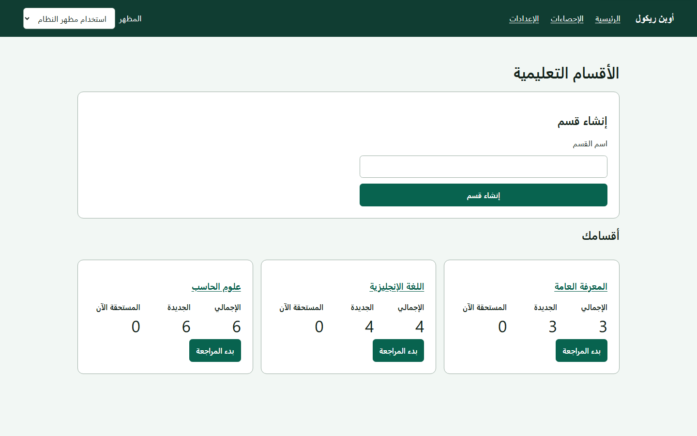
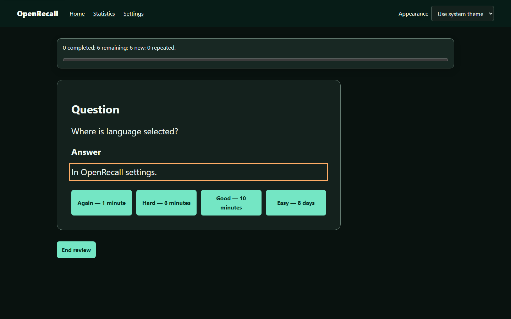

# OpenRecall

[English](README.md)

[](https://github.com/aim9sour/OpenRecall/actions/workflows/ci.yml)
[](https://github.com/aim9sour/OpenRecall/actions/workflows/windows-smoke.yml)
[](https://github.com/aim9sour/OpenRecall/releases/latest)
[](LICENSE)

OpenRecall تطبيق مراجعة متباعدة محلي صُمم للخصوصية ولوحة المفاتيح، وهدف
القبول الأساسي له Chrome مع NVDA. تظل البطاقات والسجل والإعدادات والإحصاءات
ونسخ SQLite الاحتياطية على جهازك؛ فلا حساب ولا سحابة ولا قياسات استخدام ولا
خدمة بعيدة يحتاجها التشغيل.

[**نزّل OpenRecall لنظام Windows**](https://github.com/aim9sour/OpenRecall/releases/latest)

## شغّله بنقرتين

1. نزّل `OpenRecall-v1.0.1-windows-x64.zip` من أحدث إصدار، ثم فك الملف كله
   داخل مجلد تستطيع الكتابة فيه.
2. انقر نقرًا مزدوجًا على أحد الملفين:
   - `OpenRecall.cmd` يحفظ البيانات في
     `%LOCALAPPDATA%\OpenRecall-nodejs\Data`، وهو الخيار الموصى به.
   - `OpenRecall-Portable.cmd` يحفظ البيانات داخل `Data` بجوار ملف التشغيل.

تتضمن الحزمة نسخة Node.js متحققًا منها؛ فلا تحتاج إلى Node أو pnpm أو مثبت أو
صلاحيات مسؤول أو اتصال بالإنترنت. اترك نافذة الأوامر مفتوحة أثناء المذاكرة،
وأغلق التطبيق بـ`Ctrl+C` وانتظر اكتمال الإغلاق الآمن لقاعدة SQLite. ينتظر
المشغّل جاهزية الخادم المحلي، ثم يفتح متصفح Windows الافتراضي.

> الوضع العادي والمحمول منفصلان عمدًا. نقل المجلد المفكوك ينقل بيانات الوضع
> المحمول معه، بينما تظل بيانات الوضع العادي في Local App Data. لا يدمج
> OpenRecall القاعدتين ولا ينقل بينهما تلقائيًا.



## لماذا OpenRecall مختلف؟

- حالة مجدول واحدة لكل مادة تعليمية، مع أي عدد من صيغ السؤال والإجابة
  والملاحظات. يختبر التدوير الذكي الاستدعاء الحقيقي بدل حفظ شكل بطاقة واحدة.
- طابور مستمر: تنضم البطاقة إلى الجلسة عندما يحين موعدها المخزن، من دون
  استطلاع بخطوات زمنية ثابتة.
- تقييمات FSRS الأربعة: Again وHard وGood وEasy، مع مدة تالية مفهومة بالدقائق
  أو الساعات أو الأيام أو الشهور.
- إحصاءات وإعدادات لكل قسم، وإحصاءات عامة، وتدريب المحسن، ومعاينة ملفات
  المعاملات وتطبيقها والتراجع عنها مع بدائل آمنة.
- كشف التطابق التام قبل استيراد JSON، وإعادة تسمية القسم وحذفه نهائيًا، وسلة
  البطاقات واستعادتها وحذفها، والسمات، وRTL/LTR.
- نسخ احتياطي واستعادة متحقق منها بملفات SQLite فقط؛ JSON لتبادل البطاقات
  وليس للنسخ الاحتياطي.



## عقد الإتاحة

كل وظيفة قابلة للاستخدام بلوحة المفاتيح. ينتقل التركيز في المراجعة إلى محتوى
السؤال النصي العادي، ثم إلى محتوى الإجابة عند عرضها، ثم إلى السؤال التالي بعد
التقييم. الكلمات «السؤال» و«الإجابة» و«الملاحظات» الاختيارية هي عناوين قابلة
للتنقل، أما المحتوى نفسه فنص عادي كي لا يسبق النطق التلقائي اسم العنوان.
إعلانات الحالة قصيرة ولا تكرر نص البطاقة الخاص.

Chrome المستقر مع NVDA هو هدف القبول الأساسي على Windows. تكمل اختبارات axe
وPlaywright الاختبار اليدوي بالعربية والإنجليزية ولا تستبدله. لا يتحكم
OpenRecall في NVDA ولا يغيّر إعداداته.

## استيراد البطاقات

ابدأ من [`examples/cards.valid.json`](examples/cards.valid.json)، واقرأ
[الصيغة الكاملة](docs/import/format.md). الحقلان `front` و`back` إلزاميان كنص
صريح، و`notes` و`variants` اختياريان. تظهر معاينة فيها المكررات ومسارات
الأخطاء بدقة، ثم تُحفظ الصفوف الصحيحة التي حددتها فقط.

## حدود المجدول والمحسن

خط الإصدار الأول هو **FSRS-6** عبر `ts-fsrs@5.4.1`، وله 21 معاملًا ومحول ذو
نسخة محفوظة. يستخدم المحسن `@open-spaced-repetition/binding@0.5.0`.
‏FSRS-7 غير مدعوم: البنية مستعدة لمحول upstream مستقر في المستقبل، لكن
الإصدار الأول لا يدعي ولا يحاكي السلوك التجريبي. راجع
[بروتوكول ترقية المجدول](docs/architecture/scheduler-upgrades.md).

## الخصوصية وأمان النسخ الاحتياطي

يستمع خادم الإنتاج فقط على `http://127.0.0.1:3210`. تمنع اختبارات الأمان DNS
والاتصالات الخارجة، ولا يحتفظ المتصفح بمخزن تشغيل دون اتصال، ولا تسجل
التشخيصات محتوى البطاقات.

أنشئ نسخة SQLite من الإعدادات قبل أي تغيير خطر، ولا تنسخ ملف القاعدة الحية
وحده أثناء عمل الخادم. حذف القسم نهائيًا يزيل بطاقاته الحالية وحالة المجدول
وسجله فورًا، لكن نسخة SQLite كاملة أقدم قد تظل محتوية عليه حتى تحذف ملف النسخة.

ستجد تفاصيل Windows والاستعادة في
[`docs/getting-started/windows-ar.md`](docs/getting-started/windows-ar.md).

## البناء من المصدر

يحتاج التطوير إلى Node.js 24.18.x وpnpm 11.17.0:

```bash
pnpm install --frozen-lockfile
pnpm build
pnpm start
```

انتظر `OPENRECALL_READY` ثم افتح `http://127.0.0.1:3210` في Chrome. استخدم
`pnpm dev` للتطوير و`pnpm verify:full` لتشغيل فحص الأنواع والتراخيص والوحدات
والخصائص والتكامل والأمان والبناء وتشغيل الإنتاج والإتاحة وRTL/LTR وPlaywright
بالتتابع. لا تشغّل البوابات الثقيلة معًا داخل نسخة العمل نفسها كي لا تنتج
مهلات مضللة بسبب تزاحم الموارد.

## روابط المشروع

- [نظرة المعمارية](docs/architecture/overview.md)
- [قاعدة البيانات والترحيلات](docs/architecture/database-schema.md)
- [المساهمة](CONTRIBUTING.md)
- [الدعم](SUPPORT.md)
- [سياسة الأمان](SECURITY.md)
- [سجل التغييرات](CHANGELOG.md)
- [قرار الترخيص](docs/decisions/licensing.md)

OpenRecall مرخص تحت [Apache-2.0](LICENSE). اتبع
[`CONTRIBUTING.md`](CONTRIBUTING.md) للمساهمة و[`SECURITY.md`](SECURITY.md)
للإبلاغ الأمني.

## حدود الإصدار الأول

لا توجد حسابات أو استضافة بعيدة أو مزامنة سحابية أو تعاون أو استيراد حزم
Anki أو غلاف أصلي للهاتف أو سطح المكتب. الصور والصوت والفيديو وHTML وMarkdown
وLaTeX والمحتوى التنفيذي غير مدعومة عمدًا، كما أن جدولة FSRS-7 التجريبية
خارج حدود الإصدار الأول.
